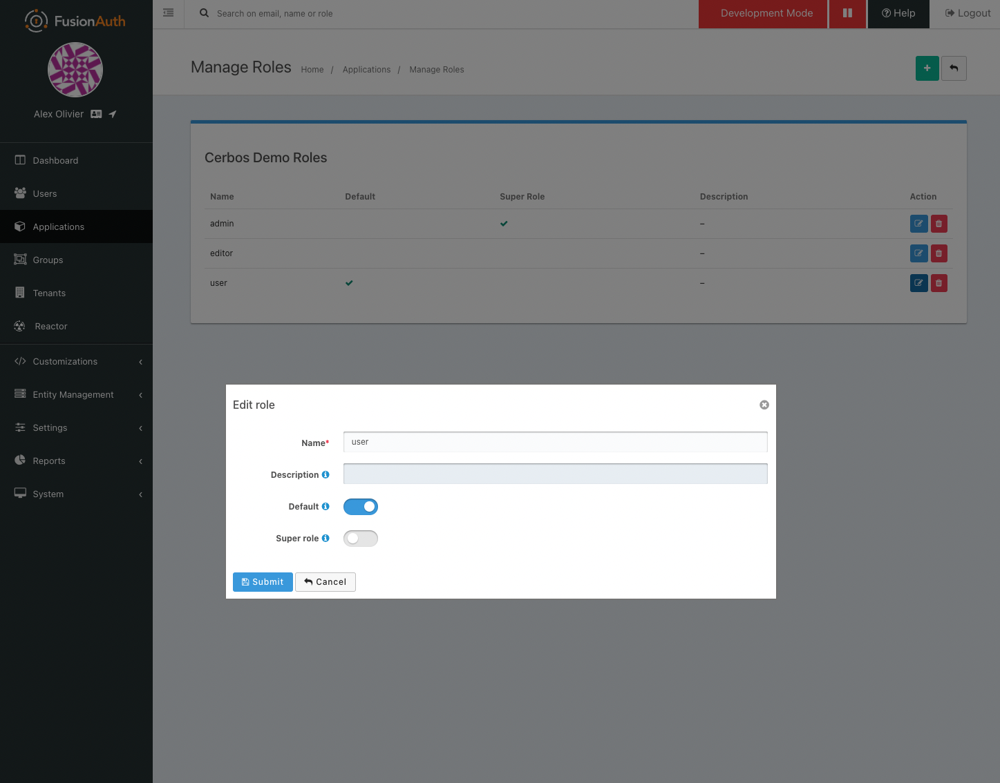

# express-fusionauth-cerbos

An example stacj of integrating [Cerbos](https://cerbos.dev) with an [Express](https://expressjs.com/) server using [FusionAuth](https://fusionauth.io) for authentication and user management.

## Dependencies

- docker-compose

## Getting Started

### Start Stack

Start up the stack `docker compose up` - this will take some time to pull down all the images and launch them, but once started the following services will be running.

- FusionAuth [http://localhost:9011](`http://localhost:9011`)
- Cerbos [http://localhost:3592/](`http://localhost:3592/`)
- Node App [http://localhost:8080/](`http://localhost:8080/`)
- Postgres DB for FustionAuth on port `5432`

### Configure FusionAuth

This example is based off the [https://fusionauth.io/docs/v1/tech/5-minute-setup-guide/](FusionAuth 5 Minute Guide) - and most of the steps have bee handled by the `docker compose` setup.

The only manual steps required are creating the application. To do this, open up [http://localhost:9011](`http://localhost:9011`) and complete the setup wizard, then:

Once we arrive in the FusionAuth admin UI, the first thing we need to do is create an Application. An Application is something that a user can log into. This is the application we are building or that we are migrating to use FusionAuth. We’ll click the Application menu option on the left side of the page or the Setup button in the box at the top of the page.


This will take us to the listing page for Applications. Next, we’ll click the green plus button (the add button) at the top of the page:


On the Application form, we’ll need to provide a name for our Application (only used for display purposes) and a couple of items on the OAuth tab. We’ll start with a simple setup that allows existing users to log into your application. Therefore, we won’t need to define any roles or registration configuration. If we click on the OAuth tab, we’ll see these options:


Most of the defaults will work, but we also need to provide these items:

- An authorized redirect URL. This is the route/controller in our application’s backend that will complete the OAuth workflow. This is also known as the 'Backend for Frontend' or BFF pattern, and is a lightweight proxy. In our example, we set this to http://localhost:3000/oauth-redirect. We’ll show some Node.js example code below for this route.

- Optionally, we can specify a valid Logout URL. This is where the user will be redirected to after they are logged out of FusionAuth’s OAuth front-end: our application.

- We need to ensure that the Authorization Code grant is selected in the Enabled Grants.

Next we need to add the roles that will be used by our policies. Back on the application listing page press the 'Manage Roles' button next to our application and add roles for `user` and `editor` (admin should already exist). These roles will be passed back with the user information to our application, and then passed onto Cerbos for use in authorization decisions.



Once we have all of this configured, we can then copy the Client ID and Client Secret and move to the next step.

### Configure Node App

Now that our application has been created, we need to add the Client ID and Client Secret from FusionAuth into the top of `app/index.js` (line 12 & 13). These will be used to identify the app through the login flow.


### Test the app

Now that everything is wired up you should be able to goto [http://localhost:8080](`http://localhost:8080`) and press the login link to authenticate with your FusionAuth account.

## Policies

This example has a simple CRUD policy in place for a resource kind of `contact` - like a CRM system would have. The policy file can be found in the `cerbos/policies` folder [here](https://github.com/cerbos/express-fusionauth-cerbos/blob/main/cerbos/policies/contact.yaml).

Should you wish to experiment with this policy, you can <a href="https://play.cerbos.dev/p/sZC611cf06deexP0q8CTcVufTVau1SA3" target="_blank">try it in the Cerbos Playground</a>.

<a href="https://play.cerbos.dev/p/sZC611cf06deexP0q8CTcVufTVau1SA3" target="_blank"></a>

The policy expects one of two roles to be set on the principal - `admin` and `user`. These roles are authorized as follows:

| Action | User | Admin |
| ------ | ---- | ----- |
| list   | Y    | Y     |
| read   | Y    | Y     |
| create | N    | Y     |
| update | N    | Y     |
| delete | N    | Y     |


## Request Flow

1. User access the application and clicks `Login`
2. User is directed to the FusionAuth UI and authenticates
3. A token is returned back in the redirect URL to the application
4. That token is then exchanged for the user profile information
5. The user profile from FusionAuth being stored (user Id, email, roles etc).
6. Any requests to the `/contacts` endpoints fetch the data required about the resource being accessed from the data store
7. Call the Cerbos PDP with the principal, resource and action to check the authorization and then return an error if the user is not authorized. The [Cerbos package](https://www.npmjs.com/package/cerbos) is used for this.

```js
const allowed = await cerbos.check({
  principal: { // from the FusionAuth profile
    id: req.session.user.id,
    roles: req.session.user.roles,
  },
  resource: {
    kind: "contact",
    instances: {
      //a map of the resource(s) being accessed
      [contact.id]: {
        attr: contact,
      },
    },
  },
  actions: ["read"], //the list of actions being performed
});

// not authorized for read action
if (!allowed.isAuthorized(contact.id, "read")) {
  return res.status(403).json({ error: "Unauthorized" });
}
```

1. Serve the response if authorized

## Example Requests

Once a JWT token has been generated requests can be made to the express server.

### List contacts

Allowed for `user` and `admin` roles

```bash
curl -X GET 'http://localhost:8080/contacts' \
--header 'Authorization: Bearer <token here>'
```

### Get a contact

Allowed for `user` and `admin` roles

```bash
curl -X GET 'http://localhost:8080/contacts/abc123' \
--header 'Authorization: Bearer <token here>'
```

### Create a contact

Allowed for `admin` role only

```bash
curl -X POST 'http://localhost:8080/contacts/new' \
--header 'Authorization: Bearer <token here>'
```

Should this request be made with the JWT roles set to `["admin"]` the response will be"

```json
{ "result": "Created contact" }
```

Should this request be made with the JWT roles set to `["user"]` the response will be:

```json
{ "error": "Unauthorized" }
```

### Update a contact

Allowed for `admin` role only

```bash
curl -X PATCH 'http://localhost:8080/contacts/abc123' \
--header 'Authorization: Bearer <token here>'
```

Should this request be made with the JWT roles set to `["admin"]` the response will be"

```json
{ "result": "Contact updated" }
```

Should this request be made with the JWT roles set to `["user"]` the response will be:

```json
{ "error": "Unauthorized" }
```

### Delete a contact

Allowed for `admin` role only

```bash
curl -X DELETE 'http://localhost:8080/contacts/abc123' \
--header 'Authorization: Bearer <token here>'
```

Should this request be made with the JWT roles set to `["admin"]` the response will be"

```json
{ "result": "Contact deleted" }
```

Should this request be made with the JWT roles set to `["user"]` the response will be:

```json
{ "error": "Unauthorized" }
```
